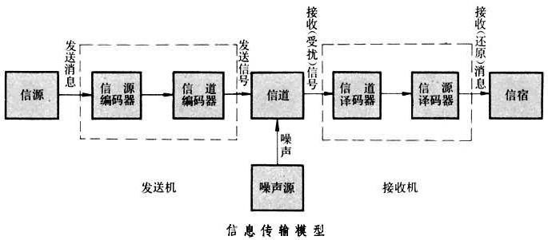
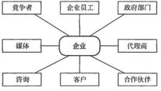

# 1. 信息化知识

## 1.1. 信息与信息化

### 1.1.1. 信息

#### 1.1.1.1. 信息的重要性

+ 信息资源日益成为重要生产要素、无形资产和社会财富，被认为是与土地、能源、材料同等重要的战略资源。
+ 电子政务在提高行政效率、改善政府效能、扩大民主参与等方面的作用日益显著。
+ 信息安全的重要性与日俱增，成为各国面临的共同挑战。

#### 1.1.1.2. 信息的概念

+ 信息是客观事物状态和运动特征的一种普遍形式，客观世界中大量地存在、产生和传递着以这些方式表示出来的各种各样的信息。
+ 维纳认为：信息就是信息，既不是物质也不是能量。
+ 香农认为：信息就是能够消除不确定性的东西。
+ 经济管理学家认为：信息是提供决策的有效数据。

#### 1.1.1.3. 信息的传输模型

+ 信源
+ 信宿
+ 信道
+ 编码器
+ 译码器
+ 噪声

### 1.1.2. 信息系统

#### 1.1.2.1. 信息系统的定义

+ 信息系统是一种以处理信息为目的的专门的系统类型。
+ 由计算机硬件、网络和通讯设备、计算机软件、信息资源、信息用户和规章制度组成的能进行信息的收集、传递、贮、加工、维护和使用的系统。

#### 1.1.2.2. 信息系统的生命周期

+ 系统规划（可行性分析、项目开发计划）
+ 系统分析（需求分析）
+ 系统设计（概要设计、详细设计）
+ 系统实施（编码、测试）
+ 运行维护

### 1.1.3. 信息化

信息化是指培养、发展以计算机为主的智能化工具为代表的新生产力，并使之造福于社会的历史过程。

+ 产品信息化
+ 企业信息化
+ 产业信息化
+ 国民经济信息化
+ 社会生活信息化

### 1.1.4. 国家信息化体系要素

国家信息化体系包括：
+ 信息技术应用
+ 信息资源
+ 信息网络
+ 信息技术和产业
+ 信息化人才
+ 信息化法规政策和标准规范

信息化体系六要素关系：
+ 信息技术应用是信息化体系六要素中的龙头，是国家信息化建设的主阵地。
+ 信息资源的开发利用是国家信息化的核心任务，是国家信息化建设取得实效的关键，也是我国信息化的薄弱环节。
+ 信息网络是信息资源开发利用和信息技术应用的基础，是信息传输、交换和共享的必要手段。
+ 信息技术和产业是我国进行信息化建设的基础。
+ 信息化人才是国家信息化成功之本，对其他各要素的发展速度和质量有着决定性的影响，是信息化建设的关键。
+ 信息化政策法规和标准规范用于规范和协调信息化体系各要素之间关系，是国家信息化快速、持续、有序、健康发展的根本保障。

### 1.1.5. 信息技术发展及趋势

信息技术发展趋势和新技术应用包括以下10个方面：
+ 高速度大容量
+ 集成化和平台化
+ 智能化
+ 虚拟计算
+ 通信技术
+ 遥感和传感技术
+ 移动智能终端
+ 以人为本
+ 信息安全
+ 两化融合

## 1.2. 国家信息化战略和规划

### 1.2.1. 国家信息化战略目标

2006~2020年期间，我国信息化发展的战略目标是：综合信息基础设施基本普及，信息技术自主创新能力显著增强，信息产业结构全面优化，国家信息安全保障水平大幅提高，国民经济和社会信息化取得明显成效，新型工业化发展模式初步确立，国家信息化发展的制度环境和政策体系基本完善，国民信息技术应用能力显著提高，为迈向信息社会奠定坚实基础。

### 1.2.2. 我国信息化发展的主要任务和发展重点

+ 促进工业领域信息化深度应用
+ 加快推进服务业信息化
+ 积极提高中小企业信息化应用水平
+ 协力推进农业农村信息化
+ 全面深化电子政务应用
+ 稳步提高社会事业信息化水平
+ 统筹城镇化与信息化互动发展
+ 加强信息资源开发
+ 构建下一代国家综合信息基础设施
+ 促进重要领域基础设施智能化改造升级
+ 着力提高国民信息能力
+ 加强网络与信息安全保障体系建设

## 1.3. 电子政务

### 1.3.1. 电子政务的概念

电子政务是指政府机构在其管理和服务职能中运用现代信息技术，实现政府组织结构和工作流程的重组优化，超越时间、空间和部门分隔的制约，建成一个精简、高效、廉洁、公平的政府运作模式。

### 1.3.2. 电子政务的内容

电子政务的内容非常广泛，国内外也有不同的内容规范，根据国家政府所规划的项目来看，电子政务主要包括如下几个方面。
+ 政府间的电子政务(G2G)
+ 政府对企业的电子政务(G2B)
+ 政府对公众的电子政务(G2C)
+ 政府对公务员的电子政务(G2E)

## 1.4. 企业信息化和两化深度融合

### 1.4.1. 企业信息化概述

#### 1.4.1.1. 企业信息化概念

企业信息化就是：“在企业作业、管理、决策的各个层面，科学计算、过程控制、事务处理、经营管理的各个领域，引进和使用现代信息技术，全面改革管理体制和机制，从而大幅度提高企业工作效率、市场竞争能力和经济效益。

#### 1.4.1.2. 从两化融合到中国制造2025，企业信息化发展之路

我国的企业信息化经历了产品信息化、生产信息化、流程信息化、管理信息化、决策信息化、商务信息化等过程，而实施两化融合是企业落实《中国制造2025》战略规划的重要途径。

#### 1.4.1.3. 我国企业信息化发展的战略要点

+ 以信息化带动工业化
+ 信息化与企业业务全过程的融合、渗透
+ 信息产业发展与企业信息化良性互动
+ 充分发挥政府的引导作用
+ 高度重视信息安全
+ 企业信息化与企业的改组改造和形成现代企业制度有机结合
+ 因地制宜推进企业信息化

### 1.4.2. 企业资源计划（ERP）

#### 1.4.2.1. ERP概念

由美国Gartner Group公司于20世纪90年代提出，它是由MRP逐步演变并结合计算机技术的快速发展而来的，大致经历了4个阶段.
+ 基本MRP（物料需求计划）
+ 闭环MRP
+ MRPII
+ ERP

20世纪90年代，随着计算机技术和管理理论的发展，在MRP中引入质量管理、设备管理、财务管理和人力资源管理，形成了统一的企业资源计划，即ERP。

一般来说，ERP是一个以财务会计为核心的信息系统，用来识别和规划企业资源，对采购、生产、成本、库存、销售、运输、财务和人力资源等进行规划和优化，从而达到最佳资源组合，使企业利润最大化

### 1.4.3. 客户关系管理（CRM）

#### 1.4.3.1. 客户关系管理概念

CRM是一个集成化的信息管理系统，它存储了企业现有和潜在客户的信息，并且对这些信息进行自动的处理从而产生更人性化的市场管理策略。

> 

### 1.4.4. 供应链管理(SCM)

#### 1.4.4.1. 供应链的概念

供应链管理是一种集成的管理思想和方法，是在满足服务水平要求的同时，为了使系统成本达到最低而采用的将供应商、制造商、仓库和商店有效地结合成一体来生产商品，有效地控制和管理各种信息流、资金流和物流，并把正确数量的商品在正确的时间配送到正确的地点的一套管理方法。

### 1.4.5. 电子商务

#### 1.4.5.1. 电子商务的概念

以信息网络技术为手段，以商品交换为中心的商务活动；也可理解为通过网络以电子交易方式进行交易活动和相关服务的活动，是传统商业活动各环节的电子化、网络化、信息化。

#### 1.4.5.2. 电子商务的类型

电子商务按照交易对象，可以分为4种：
+ 企业与企业之间的电子商务(B2B)
+ 企业与消费者之间的电子商务(B2C)
+ 消费者与消费者之间的电子商务(C2C)
+ 线上购买线下的商品和服务(O2O) 

## 1.5. 商业智能

### 1.5.1. 商业智能(BI)概念

商业智能通常被理解为将组织中现有的数据转化为知识，帮助组织做出明智的业务经营决策。

为了将数据转化为知识，需要利用数据仓库、联机分析处理(OLAP)工具和数据挖掘等技术。因此，从技术层面上讲，商业智能不是什么新技术，它只是数据仓库、OLAP和数据挖掘等技术的综合运用。

### 1.5.2. 商业智能系统应具有的主要功能

#### 1.5.2.1. 数据仓库

高效的数据存储和访问方式。提供结构化和非结构化的数据存储。

#### 1.5.2.2. 数据ETL

ETL是数据抽取(Extract)、清洗(Cleaning)、转换(Transform)、装载(Load)的过程。是构建数据仓库的重要一环，用
户从数据源抽取出所需的数据，经过数据清洗，最终按照预先定义好的数据仓库模型，将数据加载到数据仓库中去。

#### 1.5.2.3. 数据统计输出

报表能快速地完成数据统计的设计和展示。

#### 1.5.2.4. 分析功能

可以通过业务规则形成分析内容，并且展示样式丰富，具有一定的交互要求，以帮助做出正确的判断和决策。

### 1.5.3. 商业智能实现的三个层次

+ 数据报表
+ 多维数据分析
+ 数据挖掘

## 1.6. 新一代信息技术及应用

### 1.6.1. 大数据

#### 1.6.1.1. 大数据概念

指无法在一定时间范围内用常规软件工具进行捕捉、管理和处理的数据集合，是需要新处理模式才能具有更强的决策力、洞察发现力和流程优化能力来适应海量、高增长率和多样化的信息资产。

#### 1.6.1.2. 大数据特征(5V)

+ 大量(Volume)：数据的大小决定数据的价值和潜在的信息；
+ 高速(Velocity) ：指获得数据的速度；
+ 多样性(Variety) ：妨碍了处理和有效地管理数据的过程；
+ 真实性(Veracity)：数据的质量；
+ 价值(Value)：合理运用大数据，以低成本创造高价值

#### 1.6.1.3. 大数据关键技术

+ 大数据存储管理技术
+ 大数据并行分析技术
+ 大数据分析技术

### 1.6.2. 云计算

#### 1.6.2.1. 云计算概念

云计算是一种按使用量付费的模式，这种模式提供可用的、便捷的、按需的网络访问， 进入可配置的计算资源共享池（资源包括网络，服务器，存储，应用软件，服务），这些资源能够被快速提供，只需投入很少的管理工作，或与服务供应商进行很少的交互。

#### 1.6.2.2. 云计算服务的类型

按照云计算提供的资源层次分为：
+ SaaS(软件即服务)

用户根据自己实际需求，通过互联网向厂商定购所需的应用软件服务，按定购的服务多少和时间长短向厂商支付费用，并通过互联网获得厂商提供的服务。

用户不用再购买软件，而改用向提供商租用基于Web的软件，来管理企业经营活动，且无需对软件进行维护，服务提供商会全权管理和维护软件。

+ PaaS(平台即服务)

云计算时代相应的服务器平台或者开发环境作为服务进行提供就成是PaaS

PaaS平台在云架构中位于中间层，其上层是SaaS，其下层是IaaS

+ IaaS(基础设施即服务)

提供给消费者的服务是对所有计算基础设施的利用，包括CPU、内存、存储、网络和其它基本的计算资源。

### 1.6.3. 互联网+

“互联网+”就是“互联网+各个传统行业”，但这并不是简单的两者相加，而是利用信息通信技术以及互联网平台，让互联网与传统行业进行深度融合，创造新的发展生态。

它代表一种新的社会形态，即充分发挥互联网在社会资源配置中的优化和集成作用，将互联网的创新成果深度融合于经济、社会各域之中，提升全社会的创新力和生产力，形成更广泛的以互联网为基础设施和实现工具的经济发展新形态。

### 1.6.4. 智慧城市

智慧城市就是运用信息和通信技术手段感测、分析、整合城市运行核心系统的各项关键信息，从而对包括民生、环保、公共安全、城市服务、工商业活动在内的各种需求做出智能响应。

其实质是利用先进的信息技术，实现城市智慧式管理和运行，进而为城市中的人创造更美好的生活，促进城市的和谐、可持续成长。

#### 1.6.4.1. 智慧城市参考模型

+ 物联感知层
+ 通信网络层
+ 计算与存储层
+ 数据及服务支撑层
+ 智慧应用层