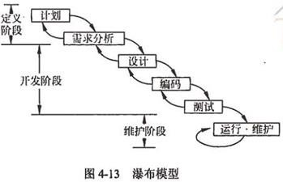
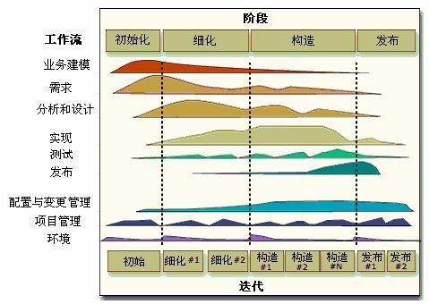
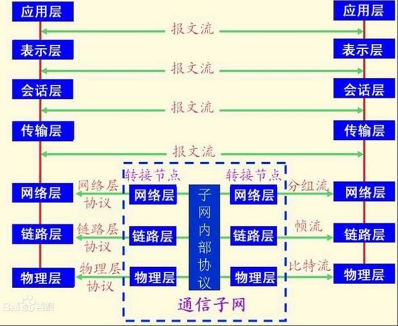
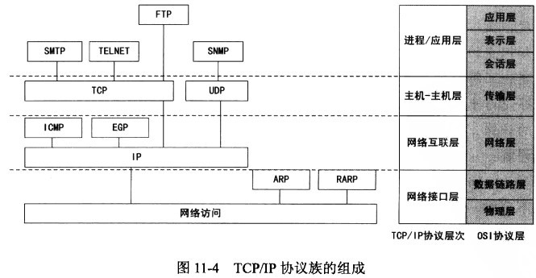
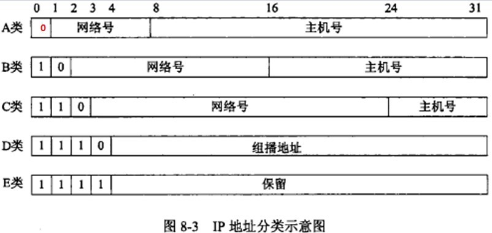

# 1. 信息系统建设

## 1.1. 信息系统建设

### 1.1.1. 信息系统的生命周期

信息系统建设的内容主要包括设备采购、系统集成、软件开发和运维服务等。系统集成是指将计算机软件，硬件、网络通信、信息安全等技术和产品集成为能够满足用户特定需求的信息系统。

信息系统的生命周期分为4个阶段：
1. 立项阶段，即其概念阶段或需求阶段，这一阶段分为两个过程：
    1. 概念的形成过程，根据用户单位业务发展和经营管理的需要，提出建设信息系统的初步构想；
    2. 需求分析过程，即对企业信息系统的需求进行深入调研和分析，形成《需求规范说明书》，经评审、批准后立项。
2. 开发阶段
    1. 总体规划阶段：以立项阶段所做的需求分析为基础，明确信息系统在企业经营战略中的作用和地位，指导信息系统的开发，优化配置并利用各种资源，包括内部资源和外部资源，通过规划过程规范或完善用户单位的业务流程。
    2. 系统分析阶段：目标是为系统设计阶段提供系统的逻辑模型，内容包括组织结构及功能分析、业务流程分析、数据和数据流程分析及系统初步方案。
    3. 系统设计阶段：根据系统分析的结果设计出信息系统的实施方案，主要内容包括系统架构设计、数据库设计、处理流程设计、功能模块设计、安全控制方案设计、系统组织和队伍设计及系统管理流程设计。
    4. 系统实施阶段：是将设计阶段的成果在计算机和网络上具体实现，即将设计文本变成能在计算机上运行的软件系统。
    5. 系统验收阶段：对系统性能的优劣及其他各项指标进行检查，判断是否满足系统需求的阶段。
3. 运维阶段

信息系统通过验收，正式移交给用户以后，就进入运维阶段。要保障系统正常运行，系统维护是不可缺少的工作。维护可分为四种类型：
+ 更正性维护
+ 适应性维护
+ 完善性维护
+ 预防性维护

4. 消亡阶段

开发一个信息系统并希望它一劳永逸地运行下去是不现实的。企业的信息系统经常不可避免地会遇到系统更新改造、功能扩展，甚至报废重建等情况。当系统不在适应当前环境，或没有必要在进行维护，系统就进入消亡阶段。

### 1.1.2. 信息系统开发方法

在系统开发时，为了更好地控制时间、质量、成本等方面的要求及达到用户满意，除了技术、管理等因素外，系统开发方法也起着很重要的作用。

常用的开发方法有：结构化方法、原型法、面向对象方法。

#### 1.1.2.1. 结构化方法

结构化方法是早期应用最为广泛的一种开发方法。

按照信息系统生命周期，应用结构化系统开发方法，把整个系统的开发过程分为若干阶段，然后一步一步地依次进行，前一阶段是后一阶段的工作依据；每个阶段又划分详细的工作步骤，顺序作业。

每个阶段和主要步骤都有明确详尽的文档编制要求，各个阶段和各个步骤的向下转移都是通过建立各自的软件文档和对关键阶段、步骤进行审核和控制实现的。

结构化方法的优点：理论基础严密，注重开发过程的整体性和全局性。

结构化方法的缺点：开发周期长；文档、设计说明繁琐，工作效率低；要求在开发之初全面认识系统的信息需求，充分预测各种可能发生的变化，但这并不十分现实；

#### 1.1.2.2. 原型法

原型法的基本思想与结构化方法不同，原型法认为在很难一下子全面准确地提出用户需求的情况下，首先不要求一定要对系统做全面、详细的调查、分析，而是本着开发人员对用户需求的初步理解，先快速开发一个原型系统，然后通过反复修改来实现用户的最终系统需求。

原型法适于用户需求开始时定义不清、结构化程度不高的系统开发，但如果用户配合不好，盲目修改，就会拖延开发过程。可以将原型分为：
+ 抛弃型原型(Throw-It-Away Prototype)，此类原型在系统真正实现以后就放弃不用了
+ 进化型原型(Evolutionary Prototype)，此类原型的构造从目标系统的一个或几个基本需求出发，通过修改和追加功能的过程逐渐丰富，演化成最终系统。

#### 1.1.2.3. 面向对象方法( Object Oriented，OO)

随着应用系统日益复杂庞大和面向对象程序设计语言的日益成熟，面向对象的系统开发方法以其直观、方便的优点获得广泛应用。面向对象开发方法主要有分析、设计和实现三个阶段。在整个过程中都使用同一套工具完成。

在系统开发的实际工作中，往往根据需要将多种开发方法进行组合应用，最终完成系统开发的全部任务。具体的组合形式可以分为如下几种:
+ 结构化方法与原型法的组合应用。
+ 结构化方法与面向对象方法的组合应用。
+ 原型法与面向对象方法的组合应用。

## 1.2. 信息系统设计

## 1.3. 软件工程

### 1.3.1. 软件工程产生

20世纪60年代末至70年代初，在软件的开发和维护过程中，软件成本日益增长、开发进度难以控制、软件质量无法保证、软件维护困难等。产生这些问题的主要原因在于：所开发软件的规模越来越大、复杂度越来越高，与此同时，用户需求并不十分明确，且缺乏软件开发方法学和工具方面的支持。

这使得人们开始将系统化的、严格约束的、可量化的方法应用于软件的开发、运行和维护，即“软件工程”。

### 1.3.2. 软件需求分析与定义

软件需求是一个为解决特定问题而必须由被开发或被修改的软件展示的特性。

软件需求包括三个不同的层次：
+ 业务需求：反映了组织机构或客户对系统、产品高层次的目标要求。
+ 用户需求：描述了用户使用产品必须要完成的任务。
+ 功能需求：定义了开发人员必须实现的软件功能，使得用户能完成他们的任务，从而满足了业务需求。

### 1.3.3. 软件设计、测试与维护

#### 1.3.3.1. 软件设计

软件设计是描述软件架构和这些组件之间的接口，然后进一步详细的描述组件，以便能构造这些组件。

#### 1.3.3.2. 软件测试

测试是为评价和改进产品质量、识别产品的缺陷和问题而进行的活动。

现在的软件测试被认为是一种应该包括在整个开发和维护过程中的活动，它本身是实际产品构造的一个重要部分。

需要注意的是，在广泛的测试活动成功完成后，软件可能仍包含错误，交付后出现的软件失效的补救措施是由软件维护达成的。

动态测试指通过运行程序发现错误，分为：
+ 黑盒测试法

黑盒测试又称为功能测试。把被测试对象看成一个黑盒子，测试人员完全不考虑程序的内部结构和处理过程，只在软件的接口处进行测试，依据需求规格说明书，检查程序是否满足功能要求。

+ 白盒测试法

又称结构测试、透明盒测试、逻辑驱动测试或基于代码的测试。把测试对象看做一个打开的盒子，测试人员必须了解程序的内部结构和处理过程，以检查处理过程的细节为基础，对程序中尽可能多的逻辑路径进行测试，检验内部控制结构和数据结构是否有错，实际的运行状态与预期的状态是否一致。

+ 灰盒测试法

灰盒测试是一种介于白盒测试与黑盒测试之间的测试，它关注输出对于输入的正确性，同时也关注内部表现，但这种关注不像白盒测试那样详细且完整，而只是通过一些表征性的现象、事件及标志来判断程序内部的运行状态。

灰盒测试结合了白盒测试和黑盒测试的要素，考虑了用户端、特定的系统知识和操作环境，在系统组件的协同性环境中评价应用软件的设计。

按测试阶段：单元测试、集成测试、系统测试和验收测试:
+ 单元测试的粒度最小，一般由开发小组采用白盒方式来测试，主要测试单元是否符合“设计”要求。
+ 集成测试界于单元测试和系统测试之间，起到“桥梁作用”，一般由开发小组采用白盒加黑盒的方式来测试，既验证“设计”，又验证“需求”
+ 系统测试的粒度最大，一般由独立测试小组采用黑盒方式来测试，主要测试系统是否符合“需求规格说明书”。
+ 验收测试与系统测试相似，主要区别是测试人员不同，验收测试由用户执行。

验收测试分为
+ α测试：是由用户在开发环境下进行的测试，也可以是公司内部的用户在模拟实际操作环境下进行的测试。α测试的目的是评价软件产品的FLURPS(即功能、局域化、可使用性、可靠性、性能和支持)。
+ β测试：是软件的真实用户在实际使用环境下进行的测试。开发者通常不在测试现场，Beta测试不能由程序员或测试员完成。

#### 1.3.3.3. 软件维护

软件投入运行，还可能发现缺陷，运行环境可能会变化，用户会提出新的需求。

软件维护包括如下类型:
+ 更正性维护

指改正在系统开发阶段已发生而系统测试阶段尚未发现的错误。

+ 适应性维护

指使用软件适应信息技术变化和管理需求变化而进行的修改。计算机领域发展变化十分迅速，经常会出现新的系统或新的版本，外部设备及其他系统软件经常在改变，常需对软件加以改造，使之适应于新的环境。为使软件产品在新的环境下仍能使用而进行的维护，称为适应性维护。

+ 完善性维护

在系统的使用过程中，用户往往要求扩充原有系统的功能，增加一些在软件需求规范书中没有规定的功能与性能特征，以及对处理效率和编写程序的改进。

+ 预防性维护

选择那些还有较长使用寿命，目前尚能正常运行，但可能将要发生变化或调整的系统进行维护，目的是通过预防性维护为未来的修改与调整奠定更好的基础。

#### 1.3.3.4. 软件复用

软件复用是指利用已有软件的各种有关知识构造新的软件，以缩减软件开发和维护的费用。

软件复用是提高软件生产力和质量的一种重要技术。

软件制品的复用，按抽象程度的高低，可以划分为：
+ 代码的复用
+ 设计的复用
+ 分析的复用
+ 测试信息的复用

### 1.3.4. 软件质量保证及质量评价

软件质量的定义是：软件特性的总和，软件满足规定或潜在用户需求的能力。也就是说，质量就是遵从用户需求，达到用户满意。

软件“产品质量”国际标准ISO9126定义的软件质量包括“内部质量”、“外部质量”和“使用质量”三部分。也就是说，“软件满足规定或潜在用户需求的能力”要从软件在内部、外部和使用中的表现来衡量。

软件质量管理过程包括：质量保证过程、验证过程、确认过程、评审过程、审计过程等。

#### 1.3.4.1. 软件质量保证

软件质量保证过程通过计划制订、实施和完成一组活动提供保证，这些活动保证项目生命周期中的软件产品和过程符合其规定的需求。

#### 1.3.4.2. 验证与确认

验证与确认过程确定某一开发和维护活动的产品是否符合活动的需求，最终的软件产品是否达到其意图并满足用户需求。

#### 1.3.4.3. 评审与审计

评审与审计过程包括：管理评审、技术评审、检查、走查、审计等。
+ 管理评审的目的是监控进展，决定计划和进度的状态，确认需求及其系统分配，或评价用于达到目标适应性的管理方法的有效性。
+ 技术评审的目的是评价软件产品。以确定其对使用意图的适合性，目标是识别规范说明和标准的差异，并向管理提供证据，以表明产品是否满足规范说明并遵从标准，而且可以控制变更。
+ 检查的目的是检测和识别软件产品异常。一次检查通常针对产品的一个相对小的部分。发现的任何异常都要记录到文档中，并提交。
+ 走查的目的是评价软件产品，走查类似于检查，但通常不那么正式。走查通常主要由同事评审其工作，以作为一种保障技术。+ 软件审计的目的是提供软件产品和过程对于可应用的规则、标准、指南、计划和流程的遵从性的独立评价。审计是正式组织的活动，识别违例情况，并产生一个报告，采取更正性行动。

### 1.3.5. 软件配置管理

软件配置管理是有益于项目管理、开发和维护活动。软件配置管理与软件质量保证活动密切相关，软件配置管理活动可以帮助达成软件质量保证目标。

### 1.3.6. 软件过程管理

软件过程管理涉及技术过程和管理过程，包括以下几个方面：
+ 项目启动与范围定义
+ 项目规划
+ 项目实施
+ 项目监控与评价
+ 项目收尾与关闭

### 1.3.7. 软件开发工具

+ 软件需求工具
+ 软件设计工具
+ 软件构造工具
+ 软件测试工具
+ 软件维护工具
+ 软件配置管理工具
+ 软件工程管理工具
+ 软件工程过程工具
+ 软件质量工具

## 1.4. 面向对象系统分析与设计

### 1.4.1. 面向对象系统分析与设计

面向对象的基本概念有对象、类、抽象、封装、继承、多态、接口、消息、组件、模式和复用等。

#### 1.4.1.1. 对象（Object）

是系统中用来描述客观事物的一个实体，它是构成系统的基本单位，由一组属性和施加于这组属性的一组操作构成。
+ 对象中的属性（Attribute）

用来描述对象静态特征的一个数据项。

+ 对象中的操作（Operation）

用来描述对象动态特征（行为）的一个动作序列。

#### 1.4.1.2. 类（class）

+ 相同属性和操作的一组对象属于同一个类
+ 它为属于该类的全部对象提供了统一的抽象描述
+ 由一个类名、一组属性和一组操作构成
+ 同一个类的对象之间，属性值可不同，操作完全相同
+ 用于创建对象，对象是类的实例。

#### 1.4.1.3. 抽象

从事物中舍弃个别的、非本质的特征，保留共同的、本质特征的做法。对象是现实世界中某个实体的抽象，类是一组对象的抽象。

#### 1.4.1.4. 封装（encapsulation）

用对象把属性和操作包装起来，形成一个独立的实体单位，并尽量对外隐蔽内部细节，外部只能看到对象操作的反应，而不知道对象是如何做出这一反应的。

#### 1.4.1.5. 继承（inheritance）

特殊类自动拥有其一般类的全部属性和操作，称为特殊类对一般类的继承，也称一般类对特殊类的泛化。

#### 1.4.1.6. 多态性（polymorphism）

特殊类可定义同名的属性或操作，来代替继承来的属性或操作；一般类中的属性或操作，在不同特殊类中可有不同的实现。

#### 1.4.1.7. 消息（message）

+ 向一个对象发送的操作请求，称为消息；
+ 对象之间通过消息进行通信，实现对象之间的动态联系。
+ 在c++中是函数调用，在Java中是方法激活。

### 1.4.2. RUP(统一软件过程)

描述了如何有效地利用商业的可靠的方法开发和部署软件，是一种重量级过程，因此特别适用于大型软件团队开发大型项目。RUP将周期划分为4个连续的阶段，即初始阶段、细化阶段、构造阶段和交付阶段。

RUP的三大特点：
+ 用例驱动的
+ 以体系结构为中心的
+ 迭代和增量的

## 1.5. 软件架构

将软件系统划分成多个模块，明确各模块之间的相互作用，组合起来实现系统的全部特性，就是系统的架构。

将一些经过实践证明的、可重复使用的软件架构设计策略总结成架构模式，以便交流和学习。

### 1.5.1. 典型架构

软件架构设计的一个核心问题是能否使用重复的架构模式，即能否达到架构级的软件复用。

常见的架构模式：
+ 管道/过滤器模式

在管道/过滤器架构模式中，每个构件都有一组输入、输出，构件读取输入的数据流，经过内部处理后，产生输出数据流，该过程主要完成输入流的变换及增量计算。

+ 面向对象模式

面向对象模式建立在数据抽象和面向对象的基础上，将数据的表示方法及其相应操作封装在一个抽象数据类型或对象中。

面向对象模式的优点如下。
+ 高度模块化。
+ 封装功能实现了数据隐藏。
+ 继承性提供了一种实现代码共享的手段。
+ 提供了系统的灵活性，便于维护及扩充。

+ 客户机/服务器模式

客户机/服务器(C/S)模式是基于资源不对等，为实现共享而提出的。C/S模式将应用一分为二，服务器（后台）负责数据管理，客户机（前台）完成与用户的交互任务。

### 1.5.2. 软件中间件

随着计算机软硬技术的迅速发展，越来越多的应用程序需要运行在网络环境的异构平台上。在分布的异构环境中，通常存在多种硬件系统平台（如PC、工作站、小型机等），而这些硬件平台上又存在各种软件（如不同的操作系统、数据库、用户界面等）。为了解决分布系统的异构问题，人们提出了中间件(Middleware)概念。

中间件是位于硬件、操作系统等平台和应用之间的通用服务，这些服务具有标准的程序接口和协议。借助中间件，解决了分布系统的异构问题。

从不同的角度对中间件的分类也会有所不同。通常将中间件分为：
+ 数据库访问中间件(ODBC、JDBC)
+ 远程过程调用中间件(RPC)
+ 面向消息中间件(MOM)
+ 分布式对象中间件(CORBA、DCOM、RMI/EJB)
+ 事务中间件(TPM)

## 1.6. 典型应用集成技术

### 1.6.1. 数据库与数据仓库技术

传统的数据库技术以单一的数据资源--数据库为中心，进行事务处理、批处理、决策分析等各种数据处理工作，主要有操作型处理和分析型处理两类。
+ 操作型处理也称事务处理，是指对联机数据库的日常操作，通常是对数据库中记录的查询和修改，主要为企业的特定应用服务，强调处理的响应时间、数据的安全性和完整性等；
+ 分析型处理则用于管理人员的决策分析，经常要访问大量的历史数据。

数据仓库(Data Warehouse)是一个面向主题的、集成的、相对稳定的、反映历史变化的数据集合，用于支持管理决策。一个典型的企业数据仓库系统通常包含数据源、数据存储与管理、OLAP服务器以及前端工具与应用四个部分。

#### 1.6.1.1. 数据仓库是面向主题的

操作型数据库的数据组织面向事务处理任务，而数据仓库中的数据是按照一定的主题域进行组织。主题是指用户使用数据仓库进行决策时所关心的重点方面，一个主题通常与多个操作型信息系统相关。

#### 1.6.1.2. 数据仓库是集成的

数据仓库的数据有来自于分散的操作型数据，将所需数据从原来的数据中抽取出来，进行加工与集成，统一与综合之后才能进入数据仓库；

#### 1.6.1.3. 数据仓库是相对稳定的

数据仓库主要是为决策分析提供数据，所涉及的操作主要是数据的查询；

#### 1.6.1.4. 数据仓库是随时间而变化的

传统的关系数据库系统比较适合处理格式化的数据，能够较好的满足商业商务处理的需求。稳定的数据以只读格式保存，且不随时间改变。

### 1.6.2. Web Services技术

Web服务(Web Services)定义了一种松散的、粗粒度的分布计算模式，使用标准的HTTP (S)协议传送XML表示及封装的内容。

Web服务的典型技术包括：
+ 简单对象访问协议（SOAP）
+ Web服务描述语言（WSDL）
+ 统一描述、发现及集成（UDDI）
+ 用于数据交换的XML

### 1.6.3. JavaEE架构

JavaEE是一个开发分布式企业级应用的规范和标准。JavaEE技术体系结构可分为：表示层技术、中间层技术、数据层技术。

+ 表示层：由用户界面和用户生成界面的代码组成。
+ 中间层：包含系统的业务和功能代码。
+ 数据层：负责完成存取数据库的数据和对数据进行封装。

### 1.6.4. NET架构

.NET架构是一个多语言组件开发和执行环境，它提供了一个跨语言的统一编程环境。.NET框架的目的是便于开发人员更容易地建立Web应用程序和Web服务，使得Internet上的各应用程序之间，可以使用Web服务进行沟通。从层次结构来看，.NET框架包括三个主要组成部分：
+ 公共语言运行时（CLR）
+ 服务框架（Services Framework）
+ 上层的两类应用模板--传统的Windows应用程序模板和基于ASP NET的面向Web的网络应用程序模板

### 1.6.5. 常用组件标准
+ 微软的COM/DCOM/COM+
+ OMG的CORBA
+ Java的EMI/EJB

## 1.7. 计算机网络

### 1.7.1. 网络技术标准与协议

#### 1.7.1.1. OSI七层模型

+ 物理层

是OSI参考模型的最低层或第一层。

物理层协议要解决的是主机、工作站等数据终端设备与通信线路上通信设备之间的接口问题。

国际电报电话咨询委员会(CCITT)和ISO用4个技术特性来描述：
1. 机械特性
2. 电气特性
3. 功能特性
4. 规程特性

+ 数据链路层

建立、维持和释放网络实体之间的数据链路，这种数据链路对网络层表现为一条无差错的信道。其服务访问点为MAC地址。

它通常把流量控制和差错控制合并在一起。数据链路层可以分为MAC（媒介访问控制）和LLC（逻辑链路控制）

+ 网络层

属于通信子网，通过网络连接交换传输层实体发出的数据。网络解决的问题是路由选择、网络拥塞、异构网络互联等问题，其服务访问点为逻辑地址（也称为网络地址）。

代表性协议有IP，IPX ,ICMP , IGMP协议等。

+ 传输层

实现发送端和接收端的端到端的数据分组传送，负责保证实现数据包无差错、按顺序、无丢失和无冗余的传输。服务访问点为端口。

代表性协议有TCP，UDP，SPX协议等。

+ 会话层
+ 表示层
+ 应用层

1. OSI是一种分层的体系结构，每一层中由一些实体（包括软件元素和硬件元素）组成，它的基本想法是每一层都在它的下层提供的服务的基础上提供更高级的增值服务，而每一层是通过服务访问点(SAP)来向上一层提供服务的。
2. 在OSI分层结构中，其目标是保持层次之间的独立性，也就是第N层实体只能够使用(N-1)层实体通过SAP提供的服务，并且只能够向(N+1)层提供服务，实体间不能够跨层使用，也不能够同层调用。

#### 1.7.1.2. TCP/IP参考模型

TCP/IP参考模型是首先由ARPANET所使用的网络体系结构。该网络协议分为四层：网络接口层、网络互联层、传输层和应用层

### 1.7.2. Internet技术及应用

Internet中任何两台主机的IP地址不相同，但是允许一台主机拥有多个IP地址。

IP地址的长度为32位(4个字节)，分为网络号和主机号两部分。网络号标识一个网络，由互联网络信息中心( InterNIC)统一分配。主机号用来标识网络中的一个主机，由网络中的管理员来具体分配。

#### 1.7.2.1. 分类IP地址结构及类别

IP地址是由32位二进制数，即4个字节组成的，它由网络号和主机号两个字段组成。

为了便于对IP地址进行管理，把IP地址分成为5类，即A类到E类，目前大量使用的是A，B，C三类。

A类：0开头

B类：10开头

C类：110开头

D类：1110开头

E类：1111开头

#### 1.7.2.2. IPv6协议

IPv6协议，全称是“互联网协议第6版”，即下一代的网际协议。相对于IPv4来说，其主要的变化有以下两点：
+ 将IPv4的32位IP地址，扩大到128位
+ 在IPv6数据报的首部格式中，用固定格式的扩展首部取代了IPv4中可变长的选项字段。
1. IPv4首部长为20~60字节
2. IPv6首部长为40字节

##### 1.7.2.2.1. IPv6地址表示

IPv6地址的128位是以16位为一段，共分为8段，每段的16位转换为一个4位的十六进制数字，每段之间用冒号(：)分开。

2001: 0da8: d001: 0001: 0000: 0000: 0000: 0001

压缩表示：

2001: da8: d001:1:0:0:0:1

2001: da8: d001:1: :1

##### 1.7.2.2.2. 内嵌IPv4地址的IPv6地址

在IPv6地址中使用内嵌的IPv4地址

地址的第一部分使用十六进制表示，而IPv4部分采用十进制。这是过渡机制所用的IPv6地址特有的表示法。如fe80 : : 200: 5efe:58.20.27.60，这个IPv6地址的后半部分是一个IPv4地址。

IPv6提供了两类嵌有IPv4地址的特殊地址：

0000:0000:0000:0000:0000:FFFF:xxxx:xxxx 或

0000:0000:0000:0000:0000:0000:xxxx:xxxx

##### 1.7.2.2.3. IPv6地址类型

IPv6仍有三种地址类型，分别是单播、多播（也称作组播）、泛播（也称作任意播）。在IPv6里广播不再使用 。
+ 单播IPv6地址：单播地址唯一标识一个IPv6节点的接口。
+ 多播IPv6地址：多播地址标识一组IPv6节点的接口。
+ 泛播IPv6地址：泛播地址指派给多个节点的接口。发送往泛播地址的数据包只会传递给其中的一个接口，一般是隔得最近的一个接口。

##### 1.7.2.2.4. IPv4向IPv6过渡

目前解决过渡问题基本技术主要有三种：
+ 双协议栈

采用该技术的节点上同时运行IPv4和IPv6两套协议栈。这是使IPv6节点保持与纯IPv4节点兼容最直接的方式，针对的对象是通信端节点（包括主机、路由器）。

这种方式对IPv4和IPv6提供了完全的兼容，但是对于IP地址耗尽的问题却没有任何帮助。由于需要双路由基础设施，这种方式反而增加了网络的复杂度。

+ 隧道技术

隧道技术提供了一种以现有IPv4路由体系来传递IPv6数据的方法。将IPv6的分组作为无结构意义的数据，封装在IPv4数据报中，被IPv4网络传输。

它的意义在于提供了一种使 IPv6的节点之间能够在过渡期间通信的方法，但它并不能解决IPv6节点与IPv4节点之间相互通信的问题。

+ NAT-PT

转换网关除了要进行IPv4地址和IPv6地址转换，还要包括协议的翻译，即所有地址、协议在内的转换工作都由网络设备来完成。转换网关作为通信的中间设备，可在IPv4和IPv6网络之间转换IP报头的地址，同时根据协议不同对分组做相应的语义翻译，从而使纯IPv4和纯IPv6站点之间能够透明通信。

### 1.7.3. 网络分类

网络分类标准有两种：分布范围和网络拓扑结构。

#### 1.7.3.1. 按照分布范围分布

+ 局域网（LAN）
+ 城域网（MAN）
+ 广域网（WAN）

#### 1.7.3.2. 按网络拓扑结构分类

网络拓扑结构是网络中的通信线路、计算机以及其他构件的物理布局。按网络拓扑结构分类，通常分为：
+ 总线型拓扑
+ 星型拓扑
+ 环型拓扑
+ 树型拓扑
+ 网状拓扑

### 1.7.4. 网络设备

+ 中继器(Repeater)
+ 集线器(Hub)
+ 网桥( Bridge)
+ 交换机(Switch)
+ 路由器(Router)
+ 防火墙(Firewall)

冲突域：集线器上的所有端口属于一个冲突域；交换机上的每个端口是一个冲突域。

广播域：交换机上的所有端口是一个广播域，路由器的每个端口是一个广播域。

按交换层次的不同，网络交换分为：
+ 物理层交换，如电话网
+ 链路层交换，二层交换，对MAC地址变更
+ 网络层交换，三层交换，对IP地址变更
+ 传输层交换，四层交换，对端口变更
+ 应用层交换

### 1.7.5. 网络存储技术

#### 1.7.5.1. 现有网络存储的三种模式

+ 直接连接存储(DAS)

DAS是将存储设备直接连在服务器上（SCSI接口），然后服务器连接在网络上，网络上任何客户端要访问某存储设备上的资源必须经过服务器。

DAS存储方式是以服务器为中心的，所有的数据流必须经过服务器转发，因此服务器的负担比较重，也是整个系统的瓶颈。服务器的CPU、内存及I/O均影响DAS的性能。由于连接在各个节点服务器上的存储设备是独立的，因此整个网络上的存储设备其实是分散、独立而无法共享的。

+ 网络连接存储(NAS)

NAS是以数据为中心的存储结构，是一种完全脱离服务器就可直接上网的存储设备，用户可直接通过网络共享NAS设备中的数据，解决了DAS中存储对服务器的依赖及服务器的瓶颈问题。

+ 存储区域网络(SAN)

SAN是一种以网络为中心的存储结构，不同于普通以太网，是位于服务器后端，为连接服务器、磁盘阵列、带库等存储设备而建立的高性能网络。

SAN的优势在于所有存储设备高度共享，所有存储设备可以集中管理同时具有冗余备份功能，单台服务器宕机系统照样工作。

### 1.7.6. 光网络技术

光网络技术通常可分为光传输技术、光节点技术、光接入技术。全光网(AON)是指信息从源节点到目的节点完全在光域进行，即全部采用光波技术完全信息的传输和交换的宽带网络。包括光传输、光放大、光再生、光选路、光交换、光存储、光信息处理等全光技术。

### 1.7.7. 网络接入技术

网络接入技术分为 ：
+ 光纤接入
+ 同轴接入
+ 铜线接入
+ 无线接入

### 1.7.8. 综合布线、机房工程

#### 1.7.8.1. 综合布线

##### 1.7.8.1.1. 综合布线系统概念及相关标准

综合布线系统(PDS)是楼宇和园区范围内，在统一的传输介质上建立的可以连接电话、计算机、会议电视和监视电视等设备的结构化信息传输系统。

目前在综合布线领域被广泛遵循的标准是EIA/TIA 568A。

综合布线系统分为6个子系统：建筑群子系统、设备间子系统、垂直干线子系统、管理子系统、水平子系统和工作区子系统。

##### 1.7.8.1.2. 机房工程

机房工程在设计施工中应对供配电方式、空气净化、安全防范措施以及防静电、防电磁辐射和抗干扰、防水、防雷、防火、防潮、防鼠诸多方面给予高度重视，以确保计算机系统长期正常运行工作。

一个良好的计算机机房除必须满足计算机设备对温度、湿度和空气洁净度，供电电源的质量（电压、频率、稳定性等）、接地地线、电磁场和振动等项的技术要求外，还必须满足机房工作人员对照度、流动速度、噪音等的要求。

### 1.7.9. 网络规划与设计

#### 1.7.9.1. 分级设计（分层设计）

在分级模型中，包括核心层、汇聚层和接入层。
+ 核心层：提供不同区域或者下层的高速连接和最优传送路径。

核心层的主要功能是实现骨干网络之间的优化传输，通常是点对点的，而且一般是很少的主机。核心层设计任务的重点通常是冗余能力和可靠性。

核心层所在的网络部分称为主干网，根据网络需求的地理距离、信息流量和数据负载的轻重来选择。

+ 汇聚层：提供基于策略的连接，实施与安全、流量负载和路由相关的策略。

汇聚层是接入层和核心层的“中介”，就是在工作站接入核心层前先做汇聚，以减轻核心层设备的负荷。

汇聚层具有实施策略、虚拟局域网（VLAN）之间的路由、源地址或目的地址过滤等多种功能。

在汇聚层中，应该选用支持三层交换技术和VLAN的交换机，以达到网络隔离和分段的目的。

+ 接入层：为局域网接入广域网或者终端用户访问网络提供接入。

接入层向本地网段提供工作站接入。在接入层中，减少同一网段的工作站数量，能够向工作组提供高速带宽。

接入层可以选择不支持VLAN和三层交换技术的普通交换机。

### 1.7.10. 网络安全

#### 1.7.10.1. 安全的五个基本要素

+ 机密性（确保信息不暴露给未授权的实体或进程）
+ 完整性（只有得到允许的人才能修改数据，并能够判别数据是否已被篡改）
+ 可用性（得到授权的实体在需要时可访问数据）
+ 可控性（可以控制授权范围内的信息流向和行为方式）
+ 可审查性（对出现的安全问题提供调查的依据和手段）

#### 1.7.10.2. 常见的网络安全威胁

常见的网络安全威胁包括：
+ 窃听（即非授权访问、信息泄露、资源盗取等）
+ 假冒（假扮另一个实体，如网站假冒、IP欺骗等）
+ 资源的非法授权使用
+ 流量分析
+ 破坏完整性
+ 拒绝服务

#### 1.7.10.3. 主要安全技术

+ 数据加密：重新组合信息，使只有收发双方才能够还原信息。
+ 数据签名：用于证明确实是由发送者签发的。
+ 身份认证：鉴别用户的合法性。
+ 防火墙：位于两个网络之间，通过规则控制数据包出入。
+ 内容检查：对数据内容的安全性进行检查，防止病毒、木马的破坏。

从OSI七层网络结构的角度来看：
+ 在物理层采用防窃听技术来加强通信线路的安全；
+ 在数据链路层使用通信保密技术进行链路加密，使用L2TP、PPTP来实现二层隧道通信；
+ 在网络层采用防火墙来处理信息内外网络边界的流动，利用IPSec建立透明的安全加密信道；
+ 在传输层使用SSL对低层安全服务进行抽象和屏蔽；
+ 在传输层和应用层之间建立中间件层次，以实现通用的安全服务功能，通过定义统一的安全服务接口向应用层提供身份认证、访问控制和数据加密等安全服务。

#### 1.7.10.4. 信息加密技术

信息加密技术是利用数学或物理手段，对电子信息在传输过程中和存储体内进行保护，以防止信息泄漏的技术。

包括：
+ 对称密钥技术

对称密钥技术是指加密密钥和解密密钥相同，或者虽然不同，但从其中一个可以很容易地推导出另一个。

优点是加密效率高，但密钥的传输需要经过安全可靠的途径。常见的对称密钥技术：
1. DES(数据加密标准)：使用56位的密钥对数据进行加密
2. 3DES(三重数据加密算法)：使用112位密钥对数据进行加密
3. IDEA算法：密钥长度为128位，其明文和密文都是64位

+ 非对称密钥技术

非对称密钥技术是指加密密钥和解密密钥完全不同，并且不可能从任何一个推导出另一个。

优点是适应开放性的使用环境，可以实现数字签名与验证。
1. 最常见的非对称密钥技术是RSA。它的理论基础是数论中大素
数分解。
2. 使用RSA来加密大量的数据则速度太慢，因此RSA广泛用于密
钥的分发。

#### 1.7.10.5. 虚拟专用网(VPN)

虚拟专用网是企业网在因特网等公共网络上的延伸，它通过一个私有的通道在公共网络上创建一个安全的私有连接。从本质上说VPN是一个虚信道，它可用来连接两个专用网，通过可靠的加密技术保证其安全性。

##### 1.7.10.5.1. VPN的关键技术

完整的VPN技术方案中包括
+ VPN隧道技术
+ 密码技术
+ 服务质量保证技术

常见的隧道技术根据其工作的层次可以分为三类：

二层隧道技术
+ PPTP（点到点隧道协议）
+ L2F（二层转发协议）
+ L2TP（二层隧道协议）

三层隧道技术
+ IPSec（IP层安全协议）
+ 移动IP协议
+ 虚拟隧道协议(VTP)

四层隧道技术
+ SSL VPN

密码技术

在VPN中采用的密码技术包括加解密、身份认证、密钥管理等。

#### 1.7.10.6. 防火墙

是一种位于内部网络与外部网络之间的网络安全系统。它依照特定的规则，允许或是限制传输的数据通过。

实现防火墙的产品主要有两大类：
+ 网络级防火墙

网络级防火墙也称为过滤型防火墙，是一种具有特殊功能的路由器，采用报文动态过滤技术，能够动态地检查流过的TCP/IP报文或分组头，根据企业所定义的规则，决定禁止某些报文通过或者允许某些报文通过，允许通过的报文将按照路由表设定的路径进行信息转发。相应的防火墙软件工作在传输层与网络层。

+ 应用级防火墙

应用级防火墙也称为应用网关型防火墙，目前已大多采用代理服务机制，即采用一个网关来管理应用服务，在其上安装对应于某种服务的特殊代码（代理服务程序），在此网关上控制与监督各类应用层服务的网络连接。

应用级防火墙有4种类型，适合于不同规模的企业内部网：
+ 双穴主机网关
+ 屏蔽主机网关
+ 屏蔽子网
+ 应用代理服务器

它们共同点是需要有一台主机（称之为堡
垒主机）来负责通信登记、信息转发和控
制服务提供等任务。

#### 1.7.10.7. 信息系统安全等级：

《计算机信息系统安全保护等级划分准则》将信息系统安全分为5个等级：

+ 自主保护级
+ 系统审计级
+ 安全标记保护级
+ 结构化保护级
+ 访问验证保护级

## 1.8. 新兴信息技术

### 1.8.1. 云计算

#### 1.8.1.1. 云计算架构

+ 基础设施即服务(IaaS)
+ 平台即服务(PaaS)
+ 软件即服务(SaaS)

### 1.8.2. 物联网

#### 1.8.2.1. 物联网概念

物联网就是物物相连的互联网。有两层含义：

一，物联网的核心和基础仍然是互联网，是在互联网基础上的延伸和扩展的网络；

二，其用户端延伸和扩展到了任何物品与物品之间，进行信息交换和通信。物联网通过智能感知、识别技术与普适计算等通信感知技术，广泛应用于网络的融合中，也因此被称为继计算机、互联网之后世界信息产业发展的第三次浪潮。

#### 1.8.2.2. 物联网架构

+ 感知层
+ 网络层
+ 应用层

#### 1.8.2.3. 物联网关键技术

感知层作为物联网架构的基础层面，主要是达到信息采集并将采集到的数据上传的目的。感知层的技术包括：
+ 产品和传感器（条码、RFID、传感器）自动识别技术
+ 无线传输技术
+ 自组织组网技术
+ 中间件技术

### 1.8.3. 移动互联网

是将移动通信和互联网二者结合起来，成为一体。也就是移动互联网=移动通信网络+互联网内容和应用。特点：
+ 接入移动性
+ 时间碎片性
+ 生活相关性
+ 终端多样性

#### 1.8.3.1. 移动互联网的关键技术

+ SOA
+ Web2.0
+ HTML5
+ android
+ iOS
+ Windows Phone

### 1.8.4. 大数据

指无法在一定时间范围内用常规软件工具进行捕捉、管理和处理的数据集合，是需要新处理模式才能具有更强的决策力、洞察发现力和流程优化能力来适应海量、高增长率和多样化的信息资产。