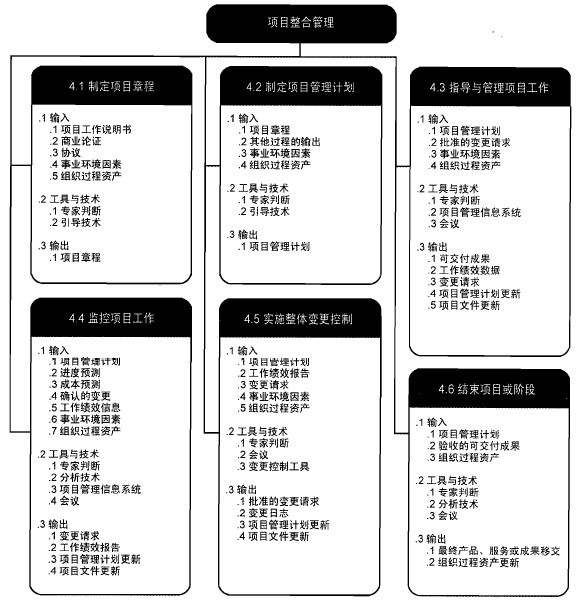
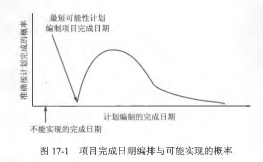
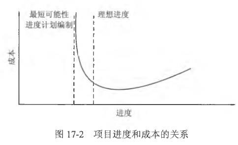
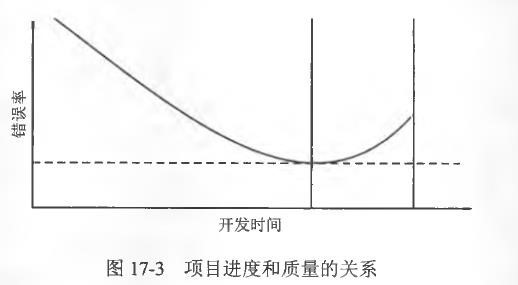
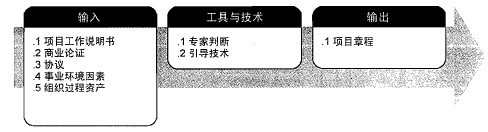
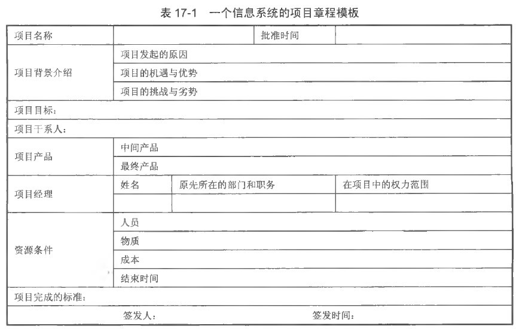
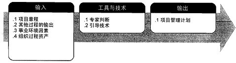

# 1. 项目整体管理

## 1.1. 项目整体管理概述

项目整体管理是从全局的、整体的观点出发通过有机地协调项目各个要素（进度、成本、质量和资源等），在相互影响的项目各项具体目标和方案中权衡和选择，尽可能地消除项目各单项管理的局限性，从而实现最大限度地满足项目干系人的需求和希望。

### 1.1.1. 项目整体管理的主要活动和流程

+ 制定项目章程。编写一份正式批准项目并授权项目经理在项目活动中使用组织资源的文件的过程。
+ 制定项目管理计划。定义、准备和协调所有子计划，并把它们整合为一份综合项目管理计划的过程。项目管理计划包括经过整合的项目基准和子计划。
+ 指导和管理项目工作。为实现项目目标而领导和执行项目管理计划中所确定的工作，并实施已批准变更的过程。
+ 实施整体变更控制。审查所有变更请求，批准变更，管理对可交付成果、组织过程资产、项目文件和项目管理计划的变更，并对变更处理结果进行沟通的过程。
+ 结束项目或阶段。完结所有项目管理过程组的所有活动，以正式结束项目或阶段的过程。

### 1.1.2. 项目整体管理的特点

项目整体管理与其他的项目单项管理（如项目进度管理、项目成本管理等）相比，具有的特点
+ 综合性
+ 全局性
    + 项目有不可压缩的最短周期
    + 项目进度和成本的关系
    + 项目进度和质量的关系
+ 系统性

#### 1.1.2.1. 项目有不可压缩的最短周期

#### 1.1.2.2. 项目进度和成本的关系

#### 1.1.2.3. 项目进度和质量的关系

### 1.1.3. 项目经理是整合者

作为整合者，项目经理必须：
+ 通过与项目干系人主动、全面的沟通，来了解他们对项目的需求。
+ 在相互竞争的众多干系人之间平衡点。
+ 通过认真、细致的协调工作，来达到各种需求间的平衡，实现整合。

## 1.2. 项目整体管理实现过程

### 1.2.1. 项目章程的作用及制订

#### 1.2.1.1. 项目章程的作用

制定项目章程过程明确指定这一过程有一个重要的输出文档“项目章程”，是正式授权一个项目和项目资金的文件。由项目发起人（高层）或者项目组织之外的主办人颁发。

+ 项目章程正式宣布项目的存在，对项目的开始实施赋予合法地位。项目章程的颁发意味着项目的企业手续合法，项目的投资者正式启动项目，职业的项目经理人和项目领导班子可以正式接手项目。
+ 项目章程将粗略地规定项目的范围，这也是项目范围管理后续工作的重要依据。
+ 规定项目的总体目标，包括范围、时间、成本和质量等。
+ 项目章程中正式任命项目经理，授权其使用组织的资源开展项目活动。

#### 1.2.1.2. 制订项目章程

#### 1.2.1.3. 制订项目章程的输入（项目启动的依据）

通常，制订项目章程要基于以下文件。
+ 项目工作说明书
+ 商业论证
+ 协议：包括合同、谅解备忘录、协议书、口头协议等。

#### 1.2.1.4. 制订项目章程的工具和技术

+ 专家判断
+ 引导技术
    + 头脑风暴
    + 冲突处理
    + 问题解决
    + 会议管理

#### 1.2.1.5. 项目章程的输出

项目章程的详细程度跟项目的大小有关，大型项目的章程相对复杂，有的称为项目任务书、项目许可证书、项目启动文件等

项目章程应该包括的主要内容：
+ 概括性的项目描述和产品描述
+ 项目的目的或批准项目的理由
+ 项目的总体要求，包括项目的总体范围和总体质量要求
+ 可测量的项目目标和相关的成功标准
+ 项目的主要风险，可以列出项目的主要风险类别
+ 总体里程碑进度计划
+ 总体预算，可以是一个概算区间，如100万元至130万元
+ 项目的审批要求，在项目的规划、执行、监控、收尾过程中，谁来做出哪种批准
+ 委派的项目经理及其职责和职权
+ 发起人或其他批准项目章程的人员的姓名和职权

## 1.3. 制订项目管理计划

### 1.3.1. 项目管理计划概述

项目管理计划是项目组织根据项目目标的规定，对项目实施过程中进行的各项活动做出周密安排。

项目管理计划系统地确定项目的任务，安排任务进度，编制完成任务所需的资源、预算等，从而保证项目能够在合理的工期内，用尽可能低的成本和尽可能高的质量完成。

#### 1.3.1.1. 项目管理计划的内容

+ 项目背景。项目名称、客户名称、项目目的等
+ 项目经理、项目管理团队和项目实施小组人员
+ 项目的总体技术解决方案
+ 对用于完成这些过程的工具和技术的描述
+ 选择的项目的生命周期和相关的项目阶段
+ 项目最终目标和阶段性目标
+ 进度计划
+ 项目预算
+ 变更流程和变更控制委员会

#### 1.3.1.2. 项目管理计划还可以包含一些辅助计划：

+ 范围管理计划
+ 进度管理计划
+ 成本管理计划
+ 质量管理计划
+ 过程改进计划
+ 人力资源管理计划
+ 沟通管理计划
+ 风险管理计划
+ 采购管理计划

## 1.4. 指导与管理项目工作

### 1.4.1. 指导和管理项目工作

对项目的执行进行统一协调的管理，把握项目实施的全局，不仅
要关注项目产品的完成情况，还要关注项目的进度，项目预算的
执行情况，也要关注项目过程和可交付物的质量，管理项目的范
围、进度、成本和质量等子目标之间的冲突与协调，以及管理项
目各有关干系人之间的冲突与协调。

项目经理以项目计划和事实为依据，积极跟进项目的实施，对项
目进行检查、指导和监督。

### 1.4.2. 指导和管理项目工作的输入

### 1.4.3. 指导和管理项目工作的工具与技术

### 1.4.4. 指导和管理项目工作的输出

### 1.4.5. 监控项目工作

项目的监督与控制的目的是提供对项目进展的理解，从而在项目
明显偏离计划时能够采取适当的纠正措施。

项目监督控制的手段主要是通过在预定的里程碑处，或者项目进
度表，将实际的工作产品和任务属性、工作量、成本，以及进度
与计划进行对比来确定进展情况。

#### 1.4.5.1. 项目监督的内容

+ 进展监督
+ 工作量和成本监督
+ 监督工作产品与任务的属性
+ 监督提供使用的资源
+ 监督项目成员的知识与技能
+ 项目风险监督

#### 1.4.5.2. 项目控制的方式

+ 正规和非正规控制
+ 预防性控制和更正性控制
+ 预先控制、过程控制和事后控制
+ 直接控制和间接控制

## 1.5. 实施整体变更控制

### 1.5.1. 整体变更控制

变更控制系统可细分为整体、范围、进度、费用和合同变更控制
系统。

整体变更就是影响项目整体和贯穿整个项目过程的变更。整体变
更控制的目的有三个：
+ 查明项目进行过程中发生的变化是否构成变更
+ 对造成变更的因素施加影响
+ 当变更实际出现时，设法处理

#### 1.5.1.1. 变更控制流程

#### 1.5.1.2. 基线与变更申请

##### 1.5.1.2.1. 基线

基线是软件配置管理的一个重要概念，是已经通过正式复审和批
准的某规约或产品，它可以作为进一步开发的基础，并且只能通
过正式的变更控制过程进行改变。

##### 1.5.1.2.2. 变更申请

项目变更的申请可能有不同的来源：可能来自一个潜在的用户、
系统分析员、测试人员或软件供应商。

#### 1.5.1.3. 变更评审

##### 1.5.1.3.1. 变更控制委员会(CCB)

项目都成立一个专门的变更控制机构---变更控制委员会（Change
Control Board,CCB), 一般来说，变更控制委员会是一个项目主要的
管理机构组织。

CCB的组成：高层经理、项目经理（技术负责人)、配置管理负责
人、质量保证负责人、测试负责人。（如果有监理的话，还应该
有监理负责人或代表）

CCB是决策机构，不是作业机构。

##### 1.5.1.3.2. 变更评审

CCB收到了变更请求(CR)后，会有专门的人员先做一个初步的分析，
主要是评估变更的来源、变更的理由、变更产生的影响、变更的
代价。一些简单且影响小的变更可以直接分配人员处理。

较大的变更请求会被提交到变更控制委员会进行评审。评审结果
如下：
+ 同意实施这项变更请求，并且在会议上安排相关的变更实施责
任人，以及相关联的协作组织。
+ 拒绝这项变更请求，并给出拒绝的理由。

#### 1.5.1.4. 变更分派

项目变更通知通常是一份比较正式的文档，需要业主、承包方、
建立方多方面签字。通知到与变更有关的各个部门或项目干系人。

#### 1.5.1.5. 变更实施

开发组要安排实施变更的必要资源，他们必须从配置库获得将被
变更部分的正式副本。对代码的修改涉及设计、编码、测试、验
证的过程，并且要对可能受影响的文档进行更新，一旦更改完成
并通过了单元测试，并对相关文档进行了更新，所有这些被赋予
新的版本号并返回到配置库置于受控状态。

#### 1.5.1.6. 变更验证

最后要对变更实施的结果进行验证，判断变更实际带来的偏差，
以及对项目其他方面的影响。

## 1.6. 结束项目或阶段

### 1.6.1. 项目收尾

项目收尾包括合同收尾和行政收尾两部分。

#### 1.6.1.1. 合同收尾

按照合同约定，项目组和业主一项项进行核对，
检查是否完成了合同所有的要求，是否可以把项目结束掉，也就
是我们通常所说的项目验收。

#### 1.6.1.2. 行政收尾

对项目工作进行全面、系统和深入的回顾，进行完工后评价，
把有关经验教训提炼出来并形成文档，成为“组织过程资产”的
一部分。行政收尾是在合同收尾之后进行的。工作包括：
+ 产品核实
+ 财务收尾
+ 更新项目记录
+ 总结经验教训
+ 进行组织过程更新
+ 结束项目干系人在项目上的关系，解散项目团队

#### 1.6.1.3. 项目验收的意义

+ 项目的验收标志着项目的结束（或阶段性结束)
+ 若项目顺利地通过验收，项目的当事人就可以终止各自的义
务和责任，从而获得相应的权益。
+ 项目的竣工验收，是保证合同任务完成，提高质量水平的最
后关口。
+ 对于基本建设项目和投资项目，通过竣工验收，促进投资项
目及时投入生产和交付使用，将基本建设投资及时转入固定资产，
发挥投资效益。

#### 1.6.1.4. 项目后评价

项目后评价是指对已经完成的项目（或规划）的目的、执行过程、
效益、作用和影响所进行的系统、客观的分析。

通过项目活动实践的检查总结，确定项目预期的目标是否达到，
项目或规划是否合理有效，项目的主要效益指标是否实现；通过
分析评价找出成败的原因，总结经验教训；并通过及时有效的信
息反馈，为提高未来新项目的决策水平和管理水平提供基础；同
时也为后评价项目实施运营中出现的问题提出改进建议，从而达
到提高投资效益的目的。

#### 1.6.1.5. 后评价的意义：

+ 后评价是一个学习过程。
+ 后评价又是增强投资活动工作者责任心的重要手段。
+ 后评价主要是为投资决策服务的。